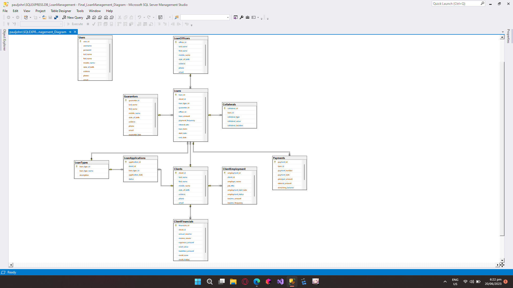

# Loan Management System

The loan management system contains the following features:

1. Login Process - This will check whether the entered username and password matches any of the user credentials saved on the database.

2. Dashboard Form - Display the number of clients, pending loan application, active loans, and overdues loans saved in database.

3. Client tab - A form where client information can be created, updated, read or deleted.
4. Guarantor tab - A form where guarantor information can be created, updated, read or deleted.
5. Loan Officer tab - A form where loan officers information can be created, updated, read or deleted.

6. Loan Process:
        Application tab - A tab where client can apply for loan.
        Pending tab - A tab specifically made to view, approve, or deny loan applications.
        Approved Loans tab - A tab to view all approved loans.
        Deny Applications tab - A tab to view all denied applications.
   
7. Payment Process:
       Active Loans tab - A tab to view and pay loans.
       Settled Loans tab - A tab to view all settled loans.

